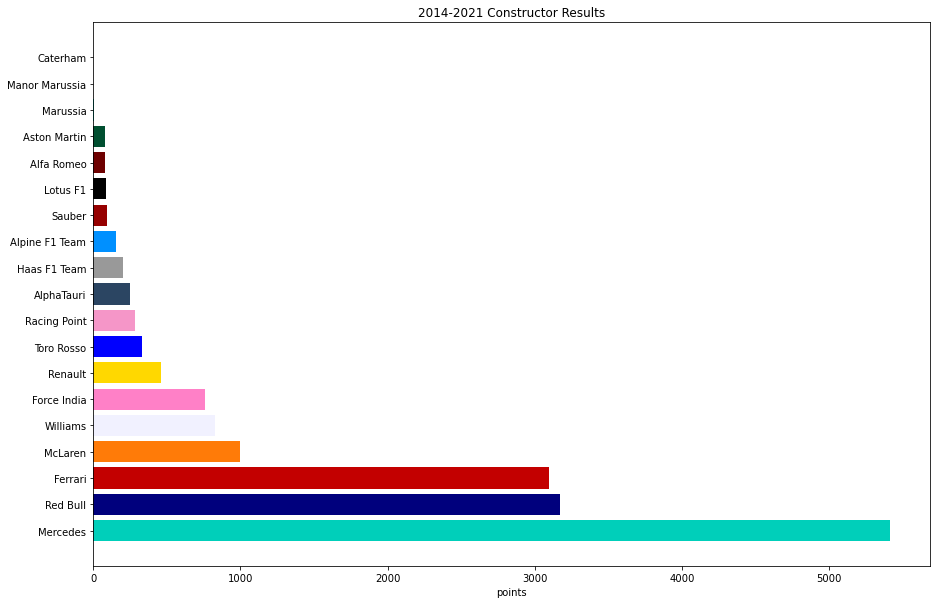

<h1 align="center">Web Design Challenge    <i>F1 Constructor Results (2014-2021)</i></h1>

<a href="https://rb25s13.github.io/mercedes-f1-hybrid-era/">Link to website</a>

The purpose of this project was to use my HTML/Bootstrap/CSS skills to demonstrate how Mercedes has dominated the last 7 years in Forumla One.

The data was pulled from Kaggle as csv files. I used a jupyter notebook to import pandas for my data clean up and matplotlib for the plots.

I created dataframes of each year of the Constructor Results and created horizontal bar charts for each. I also made a dataframe of the sum of the years 2014-2020 to show how far ahead Mercedes is currently.

							
### Contents:

        /assets - css and images
        /resources - csv's and ipynb 
        /visualizations - html pages for each year

        index.html - landing page with summary
        comparisons.html - grid of all the plots side-by-side
        data - tables of data used for plots

		
        

### Analysis:
	
        1. 2014-2020 Constructor Results

        2. 2014 Constructor Results

        3. 2015 Constructor Results

        4. 2016 Constructor Results

        5. 2017 Constructor Results

        6. 2018 Constructor Results

        7. 2019 Constructor Results
        
        8. 2020 Constructor Results

        9. 2021 Constructor Results
        